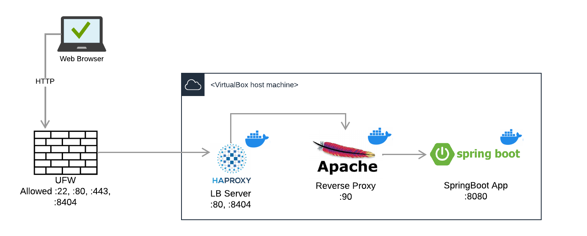

## Part I – Answers for Debug Systems Issues

1. Apparently there is a difficulty connecting to the DB service/server. In order to resolve this, I would choose to follow the steps below:

   * Backup the database;
   * Check the availability of the DB service/server;
   * make the DB service available (If the above is not complied with);

   


2.  Considering the infrastructure and the error presented:


* **(2.1.)** Everything indicates that the tomcat service is down. My first action would be to backup the application's database and then `start` the tomcat service to view the logs, if it doesn't start.


* **(2.2.)** The following could be the possible issues:

  - **Tomcat Stoped**: Solution would be to start the service.

  - **Tomcat Server Overloaded:** restart the service and install a monitoring tool on the infrastructure (eg: _munin_) to identify the real cause in the next times.

  - **Connection problems between Reverse Proxy and Tomcat:** check if `.conf` file has been configured correctly.

  - **Blocking the listening port of the tomcat container/service:** enable the port on which the service runs.

     

3. 


4. 


## Part II – Linux Laboratory

>


### Virtual Machine and Operating System

I used virtualBox version 6.x, where I created a virtual machine and installed the Operating System as proposed. Also made sure that all packages are up to date, installed *net-tools* , *openssh* and set _Bridged Adapter_ as the network type for the VM.


> **NOTE:** 
>
> > *Security settings such as changing the default ssh port, creating users with limited privileges, login by RSA key pair, etc, were not considered, assuming that is not what is being evaluated (but recognizing the need).*


Using the following command:

````
scp wit-cicd-challenge.jar wit@192.168.31.12:/home/wit/
````

 I ensured that the **.jar** file was loaded from my machine (windows 11) to the VM.


### User and privileges

These commands were executed to create `wit` user and add him to sudo group:

```bash
sudo adduser wit
```

```bash
sudo usermod -aG sudo wit
```

To test its operation, just execute `su wit` to login using wit user.

Now we have the wit user created and with the necessary privileges to move forward.


###  Docker installation and configuration

> _Instructions provided_, at the link:<https://docs.docker.com/engine/install/centos/>


````bash
sudo snapd install docker
````

In order to run docker without sudo, it was necessary to create a group and associate the user in order to have the necessary privileges.

```bash
sudo groupadd docker
```

Then, adding the user by running:

```bash
 sudo gpasswd -a $USER docker
```

Testing, it was noted that the configuration was successful.


### Architecture and description of the proposed scenario

The image below illustrates the scenario I configured, upon request.

Specifically, it is a network of containers connected to each other in order to send requests and responses between them.

There are three (3) containers:

- The first for the _Load Balancer_,
- The second for the _Reverse Proxy_, and
- The third party for the SpringBoot application.



The following tools were chosen/used:

|                 | Tool        | Comments                                                     |
| :-------------- | ----------- | ------------------------------------------------------------ |
| _Containers_    | **Docker**  | -                                                            |
| _Load Balancer_ | **HAproxy** | First layer, in contact with the outside, serving on port **:80** |
| _Reverse Proxy_ | **Apache**  | -                                                            |
| Firewall        | **UFW**     | To ensure that only the LB is accessed from the outside, the others will be accessed from the other containers or _host_ |


### Network configuration

Before starting with the creation of containers, I created a bridge network to later connect all the containers that are created. The following command was used to create the network named **redewit**:

````bash
docker network create --driver=bridge redewit
````

Executing `docker network ls`, it was possible to confirm the existence of the previously created network.


### Spring Boot container creation and configuration

For organizational reasons, I created folders to organize the files related to each container. The container associated with the Spring Boot application will be called *wit-test*, so the folder created also has the same name.

````
cd ~
````

````shell
mkdir wit-test
````

````bash
cp wit-cicd-challenge.jar wit-test/
````

````bash
nano wit-test/Dockerfile
````


I also created it in the folder or file named **Dockerfile** and copied the following content:

````dockerfile
FROM openjdk:11
COPY wit-cicd-challenge.jar wit-cicd-challenge.jar
ENTRYPOINT ["java", "-jar", "/wit-cicd-challenge.jar"]
````

- Where:

  - **Openjdk:11** is the official image created by docker

  - On the second line the **COPY** statement specifies that the .jar file should be copied

  - Finally, **ENTRYPOINT** specifies the command to be executed to host the application when the conainer is created.


Then I ran the following command to create a Docker image for the current Spring Boot project:

````bash
docker build -t wit-test wit-test/
````

Note that the first parameter refers to the image name and the second to the folder where you should find the files to be used for the build.

After executing the last command, it is possible to view the images in question using the `docker images` command

Now there is only the image that is ready to be used in the creation of the container. The following command will create the container, allow it to be visible/accessible from the outside on port **:8080** and also ensure that it is the service that will start with the operating system:

````shell
docker run -d --restart unless-stopped -p 8080:8080 --net redewit --name wit-test wit-test
````

We can confirm by running `docker ps` the existence of the container and its details.


At this point, we can already visualize the result from the outside (browser of our host machine that is running the VM):

> `<ip-do-seu-servidor>:8080`

The result should be as shown bellow:


### Criação e configuração do Reverse Proxy

Agora que configurei o container da aplicação, partirei para a configuração do reverse proxy que por sua vez fará o forward do tráfego para a aplicação.

Antes de tudo, utilizei o comando `docker pull httpd:latest` para puxar a imagem da última versão do httpd. Na pasta proxy, criei o directório **proxy** para conter o ficheiro **Dockerfile**  e outros relacionados.

````bash
mkdir proxy
````

`````bash
nano proxy/Dockerfile
`````

Conteúdo do ficheiro:

````dockerfile
# The Base Image used to create this Image
FROM httpd:latest

# to Copy a file named httpd.conf from present working directory to the /usr/local/apache2/conf inside the container
COPY httpd.conf /usr/local/apache2/conf/httpd.conf

# This is the Additional Directory where we are going to keep our Virtualhost configuraiton files
RUN mkdir -p /usr/local/apache2/conf/sites/

# To tell docker to expose this port
EXPOSE 90

CMD ["httpd", "-D", "FOREGROUND"]
````

Ainda na pasta criada **proxy**, criei o ficheiro de configuração``nano proxy/httpd.conf`` com o conteúdo do seguinte link: 

O Build e criação da imagem a partir do ficheiro **proxy/Dockerfile** será realizado após executar o comando

````bash
docker build -t proxy proxy/
````

e o mesmo é denominado *proxy* e pode ser confirmado executando `docker images`

Segue a criação do workspace que será usado para o *mount* no container e irá conter alguns ficheiros de configuração. São 2 directórios, onde o primeiro armazena os ficheiros `.conf` e o segundo os ficheiros `.html`.

````bash
mkdir -p /home/wit/apps/docker/apacheconf/sites
````

````bash
mkdir -p /home/wit/apps/docker/apacheconf/htmlfiles
````

Agora a criação do ficheiro *.conf* denominado *demowit.conf*

````bash
nano /home/wit/apps/docker/apacheconf/sites/demowit.conf
````

para conter o conteúdo a seguir:

````dockerfile
 <VirtualHost *:80>
	
	ServerName demowit.local
	ServerAlias www.demowit.local

	ServerAdmin exemplo@demowit.local
	DocumentRoot /usr/local/apache2/demowit
	
	<Directory "/usr/local/apache2/demowit">
		Order allow,deny
		AllowOverride All
		Allow from all
		Require all granted
	</Directory>

    ErrorLog logs/demowit-error.log
    CustomLog logs/demowit-access.log combined

    ProxyPass / http://wit-test:8080/
    ProxyPassReverse / http://wit-test:8080/
	
</VirtualHost>
````

Agora a criação do ficheiro html que servirá para landing page:

````bash
nano /home/wit/apps/docker/apacheconf/htmlfiles/index.html
````

O conteúdo

````html
<html>
	<head>
		<title>demowit</title>
	</head>
	<body>
		<h2> Funcionando Perfeitamente... </h2>
	</body>
</html>
````

A última configuração para esta etapa é a criação do container, associado à publicação da porta e o _mount_ dos directórios/ficheiros a serem utilizados no container.

````bash
docker container run --publish 90:80 -d --restart unless-stopped --name proxy --net redewit -v /home/wit/apps/docker/apacheconf/sites:/usr/local/apache2/conf/sites -v /home/wit/apps/docker/apacheconf/htmlfiles:/usr/local/apache2/demowit proxy
````

Lembrando que configurei a porta 90 para o reverse proxy.

No ficheiro */etc/hosts* da máquina host, deve se associar o IP ao DNS local que está sendo utilizado nos ficheiros de configuração:

`````bash
> 127.0.0.1			demowit.local
`````


>**Para testar esta configuração:**
>
>> `<ip-do-seu-servidor>:90` no browser, fora do server e mesma rede, e `curl demowit.local:90/` dentro do server


Na rota **/** está correr a aplicação que configuramos anteriormente, a partir do proxy:


> Até então configuramos o proxy, o intermediário entre o LB Server e a Aplicação SpringBoot.


### Criação e configuração do LB

Utizei HAproxy como o Load Balancer. Primeiro passo foi criar o ficheiro de configuração, para configurar o funcionamento do container:

````bash
nano haproxy.cfg
````

no ficheiro, foi incluso o seguinte código:

````bash
global
  stats socket /var/run/api.sock user haproxy group haproxy mode 660 level admin expose-fd listeners
  log stdout format raw local0 info

defaults
  mode http
  timeout client 10s
  timeout connect 5s
  timeout server 10s
  timeout http-request 10s
  log global

frontend stats
  bind *:8404
  stats enable
  stats uri /
  stats refresh 10s

frontend myfrontend
  bind :90
  default_backend webservers

backend webservers
  server s1 proxy:80 check
````

o container LB servirá na porta **:90** e o tráfego da porta **:80** do da máquina host será redireccionada para a porta **:90** do container do LB.

Estará também disponível o dahsboard do HAproxy na porta **:8404**, para a gestão.

Estando no directório onde criamos o ficheiro de configuração, executamos o seguinte comando, para criar o container, configurar a regra das portas e o mount do volume do cheiro utilizado.

````bash
sudo docker run -d \
   --name haproxy \
   --net redewit \
   -v $(pwd):/usr/local/etc/haproxy:ro \
   -p 80:90 \
   -p 8404:8404 \
   --restart unless-stopped \
   haproxytech/haproxy-alpine:2.4
````

Feito isto, a configuração foi concluída com sucesso, pelo que pode ser testado.


> **Para testar esta configuração:**
>
> > `<ip-do-seu-servidor>` no browser, fora do server e mesma rede, e `curl demowit.local` dentro do server

Na rota **/** , da porta **:80** está correr a aplicação que configuramos anteriormente, a partir do proxy:


Na rota **/** da porta **:8404**, retorna o dashboard do haproxy:


### Configurações gerais do processo

Tendo o fluxo todo está funcionar, activei o firewall para garantir que os acessos serão apenas a partir da porta **:80**,  **:443**,  **:8404** para http e porta **:22** para  SSH.

````bash
sudo ufw limit 22/tcp
````

````bash
sudo ufw allow http
````

````bash
sudo ufw allow https
````

````bash
sudo ufw limit 8404/tcp
````

````bash
sudo ufw enable
````


### Conclusão

Os containers criados, conforme proposto:


