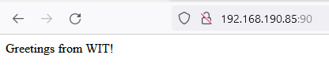
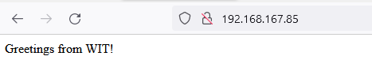
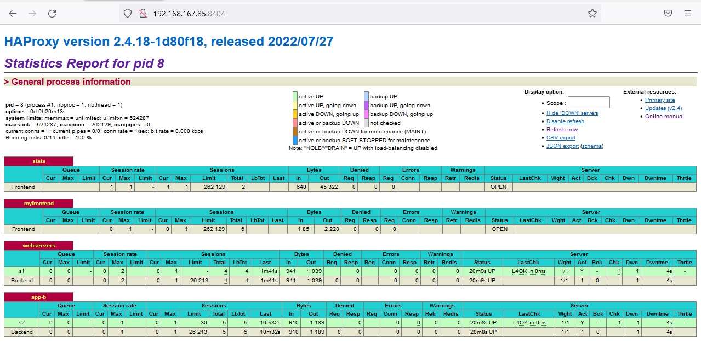

## Part I – Answers for Debug Systems Issues

1. Aparentemente existe uma dificuldade em conectar com o serviço/servidor de BD. De forma a resolver isso optaria em seguir os passos abaixo:

   * Realizar o Backup da base de dados;
   * Verificar a disponibilidade do serviço/servidor da BD;
   * Caso o anterior não se cumpra, disponibilizar  o serviço da DB;

   


2.  Considerando a infraestrutura e o erro apresentado:


* **(2.1.)** Tudo indica que o serviço tomcat está down. Minha primeira acção seria fazer o backup da base de dados da aplicação em causa e de seguida fazer o `start` do serviço tomcat para visualizar os logs, caso não inicialize.


* **(2.2.)** Os seguintes podem ser os possíveis problemas:

   - **Tomcat Stoped**: Solução seria o start da do serviço.

   - **Tomcat Server Sobrecarregado:** reiniciar do serviço e instalar na infraestrutura uma ferramenta para monitorização (ex: _munin_) para identificar a real causa nas próximas vezes.

   - **Problemas de conexão entre o Reverse Proxy e o Tomcat:** veririfcar o ficheiro `.conf` se foi configurado correctamente.

   - **Bloqueio da porta de escuta, do container/serviço tomcat:** habilitar a porta por onde o serviço é executado.

      

3. 


4. 


## Part II – Linux Laboratory

>


### Máquina virtual e  Sistema Operativo

Utilizei a versão 6.x do virtualBox, de onde criei uma máquina virtual e instalei o SO conforme proposto.
Garanti que todos pacotes estão atualizados, instalei o *net-tools* , o *openssh* e configurei _Bridged Adapter_ como o tipo de rede para a VM em causa.


> **NOTA:** 
>
> > *Aspectos ligados a segurança como o caso de alteração da porta default ssh, criação de utilizadores com privilégios limitados, login por par de chaves RSA, etc, não foram levados em consideração assumindo que não é o que está sendo avaliado. (Mas reconhecendo a necessidade).*


A partir do comando:

````
scp wit-cicd-challenge.jar wit@192.168.31.12:/home/wit/
````

 garanti que o ficheiro **.jar** fosse carregado da minha máquina (windows 11) para a VM.


### Criação do utilizador

Os seguintes comandos foram executados para a criação de utilizador wit e adicioná-lo ao grupo sudo:

```bash
sudo adduser wit
```

```bash
sudo usermod -aG sudo wit
```

Para testar o seu funcionamento:

```
su wit
```

Agora que temos o utilizador wit criado e com os privilégios necessários para avançar.


###  Instalação do docker

> _Instruções disponibilizadas no enunciado_ , no link: <https://docs.docker.com/engine/install/centos/>


````bash
sudo snapd install docker
````

Para que fosse possível executar o docker sem o sudo, foi necessário criar um grupo e associar o utilizador por  forma a ter os privilégios necessários.

```bash
sudo groupadd docker
```

De seguida, adicionando o utilizador em causa, executando:

```bash
 sudo gpasswd -a $USER docker
```

Testando notou-se que a configuração foi bem sucedida.


### Arquitetura e descrição da proposta

A figura apresentada abaixo ilustra o cenário que configurei, mediante à solicitação do enunciado.

Concretamente, trata-se de uma rede de containers conectados entre eles por forma a enviar solicitações e respostas entre as mesmas.

São três (3) containers:

- O primeiro para o _Load Balancer_,
- O segundo para o _Reverse Proxy_, e 
- O terceiro para a aplicação disponibilizada.


As seguintes tecnologias foram escolhidas/utilizadas:

|                 | Tecnologia  | Comentários                                                  |
| :-------------- | ----------- | ------------------------------------------------------------ |
| _Containers_    | **Docker**  |                                                              |
| _Load Balancer_ | **HAproxy** | Primeira camada, no contacto com o exterior, servindo na porta :80 |
| _Reverse Proxy_ | **Apache**  |                                                              |
| Firewall        | **UFW**     | Para garantir que apenas o LB seja acedido a partir do exterior, sendo que os demais serão acedidios a partir do outros containers ou _host_ |


### Criação e configuração da rede

Antes de iniciar com a criação dos containers, criei uma rede bridge para posteriormente conectar todos os containers que forem criados. O seguinte comando foi utilizado para criar a rede com o nome **redewit**:

````bash
docker network create --driver=bridge redewit
````

Executando `docker network ls`, foi possível confirmar a existência da rede previamente criada.


### Criação e configuração do container SpringBoot
Por questões de organização, criei pastas para organizar os ficheiros relacionados à cada container. O container associado ao SpringBoot será denominado *wit-test*, pelo que a pasta criada também tem o mesmo nome.

````
cd ~
````

````shell
mkdir wit-test
````

````bash
cp wit-cicd-challenge.jar wit-test/
````

````bash
nano wit-test/Dockerfile
````


Criei também na pasta o ficheiro com o nome **Dockerfile** e copiei o seguinte conteúdo:

````dockerfile
FROM openjdk:11
COPY wit-cicd-challenge.jar wit-cicd-challenge.jar
ENTRYPOINT ["java", "-jar", "/wit-cicd-challenge.jar"]
````

- Onde:

  - O **openjdk:11** é a imagem oficial criada pelo docker

  - Na segunda linha a instrução **COPY** especifica que deverá ser copiado o ficheiro .jar

  - Por fim, **ENTRYPOINT** especifica o comando a ser executado para o alojamento da aplicação quando for criado o conainer.


De seguida, executei o seguinte comando para criar uma imagem do Docker para o projeto Spring Boot atual:

````bash
docker build -t wit-test wit-test/
````

Nota que o primeiro primeiro parâmentro refere-se ao nome da imagem e o segundo à pasta onde deverá achar os ficheiros a serem usados para o build.

Finda a execução do último comando, é possível visualizar as imagens em causa a partir do comando `docker images`

Até então existe apenas a imagem que por sua vez está pronta para ser utilizada na criação do container. O seguinte comando criará o container, permitirá que esteja visível/acessível a partir de fora na porta **:8080** e ainda garantirá que seja o serviço que iniciará com o sistema operativo:

````shell
docker run -d --restart unless-stopped -p 8080:8080 --net redewit --name wit-test wit-test
````

É possível confirmar executando `docker ps` a existência do container e os respectivos detalhes.


Neste momento já podemos visualizar o resultado a partir do exterior (navegador da nossa máquina host que está rodar a VM):

> `<ip-do-seu-servidor>:8080`

O resultado deverá ser idêntico ao seguinte:


### Criação e configuração do Reverse Proxy

Agora que configurei o container da aplicação, partirei para a configuração do reverse proxy que por sua vez fará o forward do tráfego para a aplicação.

Antes de tudo, utilizei o comando `docker pull httpd:latest` para puxar a imagem da última versão do httpd. Na pasta proxy, criei o directório **proxy** para conter o ficheiro **Dockerfile**  e outros relacionados.

````bash
mkdir proxy
````

`````bash
nano proxy/Dockerfile
`````

Conteúdo do ficheiro:

````dockerfile
# The Base Image used to create this Image
FROM httpd:latest

# to Copy a file named httpd.conf from present working directory to the /usr/local/apache2/conf inside the container
COPY httpd.conf /usr/local/apache2/conf/httpd.conf

# This is the Additional Directory where we are going to keep our Virtualhost configuraiton files
RUN mkdir -p /usr/local/apache2/conf/sites/

# To tell docker to expose this port
EXPOSE 90

CMD ["httpd", "-D", "FOREGROUND"]
````

Ainda na pasta criada **proxy**, criei o ficheiro de configuração``nano proxy/httpd.conf`` com o conteúdo do seguinte link: 

O Build e criação da imagem a partir do ficheiro **proxy/Dockerfile** será realizado após executar o comando

````bash
docker build -t proxy proxy/
````

e o mesmo é denominado *proxy* e pode ser confirmado executando `docker images`

Segue a criação do workspace que será usado para o *mount* no container e irá conter alguns ficheiros de configuração. São 2 directórios, onde o primeiro armazena os ficheiros `.conf` e o segundo os ficheiros `.html`.

````bash
mkdir -p /home/wit/apps/docker/apacheconf/sites
````

````bash
mkdir -p /home/wit/apps/docker/apacheconf/htmlfiles
````

Agora a criação do ficheiro *.conf* denominado *demowit.conf*

````bash
nano /home/wit/apps/docker/apacheconf/sites/demowit.conf
````

para conter o conteúdo a seguir:

````dockerfile
 <VirtualHost *:80>
	
	ServerName demowit.local
	ServerAlias www.demowit.local

	ServerAdmin exemplo@demowit.local
	DocumentRoot /usr/local/apache2/demowit
	
	<Directory "/usr/local/apache2/demowit">
		Order allow,deny
		AllowOverride All
		Allow from all
		Require all granted
	</Directory>

    ErrorLog logs/demowit-error.log
    CustomLog logs/demowit-access.log combined

    ProxyPass / http://wit-test:8080/
    ProxyPassReverse / http://wit-test:8080/
	
</VirtualHost>
````

Agora a criação do ficheiro html que servirá para landing page:

````bash
nano /home/wit/apps/docker/apacheconf/htmlfiles/index.html
````

O conteúdo

````html
<html>
	<head>
		<title>demowit</title>
	</head>
	<body>
		<h2> Funcionando Perfeitamente... </h2>
	</body>
</html>
````

A última configuração para esta etapa é a criação do container, associado à publicação da porta e o _mount_ dos directórios/ficheiros a serem utilizados no container.

````bash
docker container run --publish 90:80 -d --restart unless-stopped --name proxy --net redewit -v /home/wit/apps/docker/apacheconf/sites:/usr/local/apache2/conf/sites -v /home/wit/apps/docker/apacheconf/htmlfiles:/usr/local/apache2/demowit proxy
````

Lembrando que configurei a porta 90 para o reverse proxy.

No ficheiro */etc/hosts* da máquina host, deve se associar o IP ao DNS local que está sendo utilizado nos ficheiros de configuração:

`````bash
> 127.0.0.1			demowit.local
`````


>**Para testar esta configuração:**
>
>> `<ip-do-seu-servidor>:90` no browser, fora do server e mesma rede, e `curl demowit.local:90/` dentro do server


Na rota **/** está correr a aplicação que configuramos anteriormente, a partir do proxy:



> Até então configuramos o proxy, o intermediário entre o LB Server e a Aplicação SpringBoot.


### Criação e configuração do LB

Utizei HAproxy como o Load Balancer. Primeiro passo foi criar o ficheiro de configuração, para configurar o funcionamento do container:

````bash
nano haproxy.cfg
````

no ficheiro, foi incluso o seguinte código:

````bash
global
  stats socket /var/run/api.sock user haproxy group haproxy mode 660 level admin expose-fd listeners
  log stdout format raw local0 info

defaults
  mode http
  timeout client 10s
  timeout connect 5s
  timeout server 10s
  timeout http-request 10s
  log global

frontend stats
  bind *:8404
  stats enable
  stats uri /
  stats refresh 10s

frontend myfrontend
  bind :90
  default_backend webservers

backend webservers
  server s1 proxy:80 check
````

o container LB servirá na porta **:90** e o tráfego da porta **:80** do da máquina host será redireccionada para a porta **:90** do container do LB.

Estará também disponível o dahsboard do HAproxy na porta **:8404**, para a gestão.

Estando no directório onde criamos o ficheiro de configuração, executamos o seguinte comando, para criar o container, configurar a regra das portas e o mount do volume do cheiro utilizado.

````bash
sudo docker run -d \
   --name haproxy \
   --net redewit \
   -v $(pwd):/usr/local/etc/haproxy:ro \
   -p 80:90 \
   -p 8404:8404 \
   --restart unless-stopped \
   haproxytech/haproxy-alpine:2.4
````

Feito isto, a configuração foi concluída com sucesso, pelo que pode ser testado.


> **Para testar esta configuração:**
>
> > `<ip-do-seu-servidor>` no browser, fora do server e mesma rede, e `curl demowit.local` dentro do server

Na rota **/** , da porta **:80** está correr a aplicação que configuramos anteriormente, a partir do proxy:



Na rota **/** da porta **:8404**, retorna o dashboard do haproxy:




### Configurações gerais do processo

Tendo o fluxo todo está funcionar, activei o firewall para garantir que os acessos serão apenas a partir da porta **:80**,  **:443**,  **:8404** para http e porta **:22** para  SSH.

````bash
sudo ufw limit 22/tcp
````

````bash
sudo ufw allow http
````

````bash
sudo ufw allow https
````

````bash
sudo ufw limit 8404/tcp
````

````bash
sudo ufw enable
````


### Conclusão

Os containers criados, conforme proposto:


