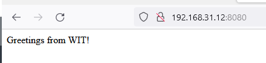

## Part I – Answers for Debug Systems Issues

1. 

2. 

		1. 

		2. 


3. 


4. 


## Part II – Linux Laboratory


### Criação da Máquina virtual, instalação e configuração do Sistema Operativo

No meu caso, utilizei a versão 6.x do virtual box, de onde criei uma máquina virtual e instalei o SO conforme proposto.
Garanti que todos pacotes estão actualizados, instalei o `net-tools` , o `openssh` e configurei Bridged Adapter como o tipo de rede para a VM em causa.

> **NOTA:** 
 *Aspectos ligados a segurança como o caso de alteração da porta default ssh, criação de utilizadores com privilégios limitados, login por par de chaves RSA, etc, não foram levados em consideração assumindo que não é o que está sendo avaliado. (Mas reconhecendo a necessidade).*

A partir do comando `scp wit-cicd-challenge.jar wit@192.168.31.12:/home/wit/`, garanti que o ficheiro `.jar` fosse carregado da minha máquina (windows no meu caso) para a VM.


### Processo de intalação do docker e garantir que irá executar sem o `sudo`


### Arquitetura e descrição da proposta


### Criação e configuração da rede

Antes de iniciar com a criação dos containers, foi criada um rede bridge para conectarmos posterior conectar todos os containers que forem criados. O seguinte comando foi utilizado para criar a rede com o nome redewit

`docker network create --driver=bridge redewit`

Executando `docker network ls`, será possível confirmar a existência da rede previamente criada.

### Criação e configuração do container SpringBoot
Por questões de organização, criaremos pastas para organizar os ficheiros relacionados à cada container. O container associado ao springBoot será denominado `wit-test`, pelo que a pasta criada poderá também ter o mesmo nome.

````
cd
mkdir wit-test
cp wit-cicd-challenge.jar wit-test/
````

Criei também na pasta o ficheiro com o nome `Dockerfile` e copiei o seguinte conteúdo:

````
FROM openjdk:11
COPY wit-test/wit-cicd-challenge.jar wit-cicd-challenge.jar
ENTRYPOINT ["java", "-jar", "/wit-cicd-challenge.jar"]
````

Onde:
- O `openjdk:11` é a imagem oficial criada pelo docker
- Na segunda linha a instrução COPY especifica que deverá ser copiado o ficheiro .jar
- Por fim, ENTRYPOINT especifica o comando a ser executado para o alojamento da aplicação quando for criado o conainer.

De seguida, executei o seguinte comando para criar uma imagem do Docker para o projeto Spring Boot atual:

`docker build -t wit-test wit-test`

Nota que o primeiro primeiro parâmentro refere-se ao nome da imagem e o segundo à pasta onde deverá achar os ficheiros a serem usados para o build.

Finda a execução do último comando, poderá visualizar as imagens em causa a partir do comando `docker images`

Até então só existe a imagem que por sua vez está pronta para ser utilizada na criação do container. O seguinte comando criará o container, permitirá que esteja visível/acessível a partir de fora na porta 8080 e ainda garantirá que seja o serviço que iniciará com o sistema operativo:

`docker run -d --restart unless-stopped -p 8080:8080 wit-test`

É possível confirmar executando `docker ps` a existência do container e os respectivos detalhes.


Neste momento já podemos visualizar o resultado a partir do exterior (navegador da nossa máquina host que está rodar a VM):

`<ip-do-seu-servidor>:8080`

O resultado deverá ser idêntico ao seguinte:



### Crianção e configuração do Proxy


### Criação e configuração do LB


### Configurações gerais do processo


